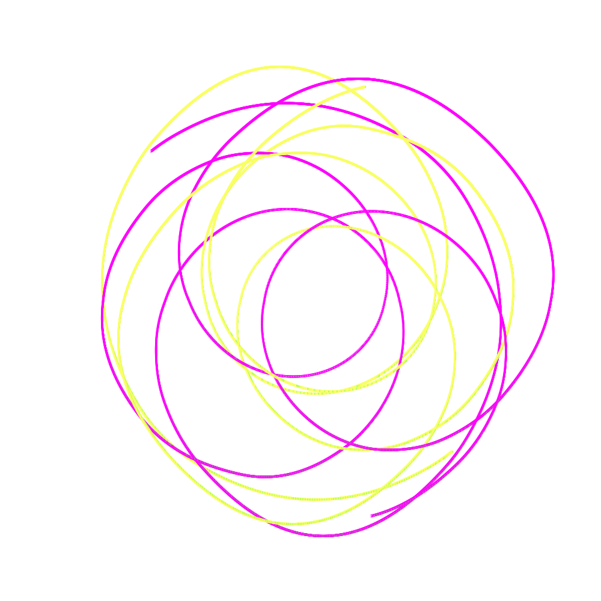

# gravitation-model

This project provide a simulation of movement of N particles in a flat space
determined by their mass, initial position, inititial speed, and gravity force.

The scale of representation is `1 pixel : 1e12 m`

Mass can be represented using constants

- `TON` = 1e3 kg
- `KTON` = 1e6 kg
- `MT` (Mass of earth) = 5.972e24 kg

Gravitational constant is expressed in N m^2 / kg^2

- `G` = 6.67430e-11

# How to use

On the main.go file you should

1. Create a new system

```go
sys := system.New()
```

2. Define your particles, providing position and velocity for both axis, mass, a string key and a color to trace

```go
p1 := &system.Particle{X: 250, Y: 250, Vx: 0.5, Vy: -0.4, Color: color.RGBA{255,0,255,255}, Mass: 2 * constants.MT, Key: "1"}
```

3. Add your particles to the system

```go
sys.AddParticle(p1)
```

4. Build the system

```go
sys.Build()
```

# Run

In order to run the project, you need to have go intalled on your machine. Then you need to run

`make tidy` to install the dependencies

`make run` to run the go application

# Result

The resulting image is saved at model.png

